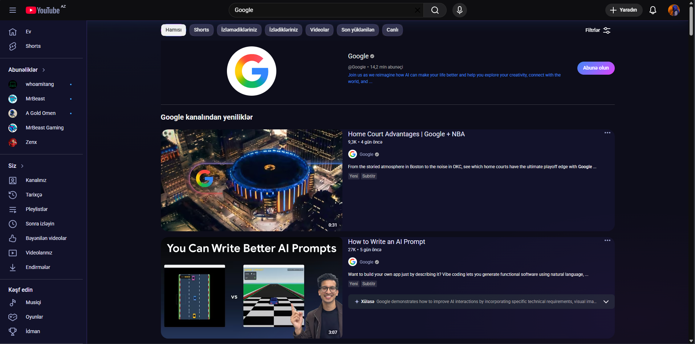
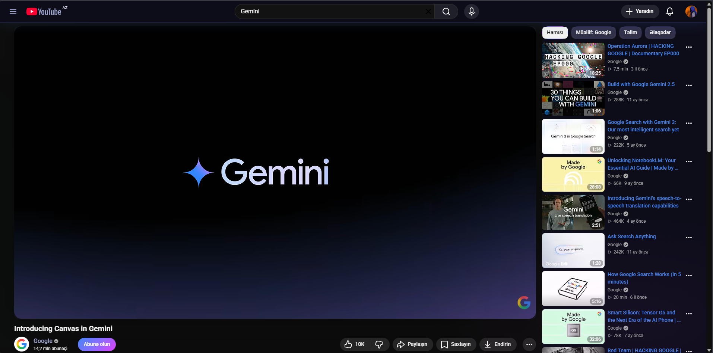
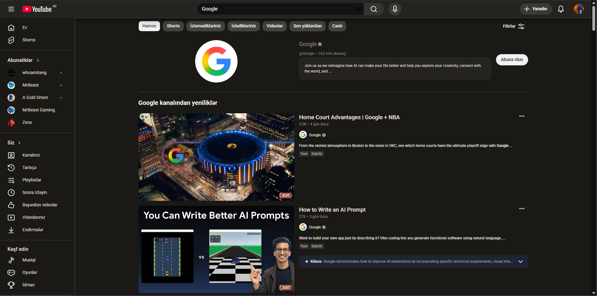
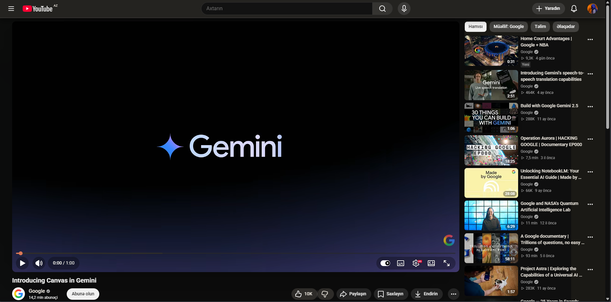

# YouTube Reskin

**Premium AI-Inspired Themes for YouTube**

- **Astral-UI** — Gemini inspired (Dark Purple Space Theme)  
- **Copper-UI** — Claude inspired (Warm Copper Theme)

---

## Features

- Complete YouTube interface redesign
- Modern AI-company inspired aesthetics
- Optimized dark mode look
- Lightweight and fast
- No tracking

---

## Installation (Load Unpacked)

1. Download or clone this repository.
2. Open `chrome://extensions/` in Chrome, Edge or Brave.
3. Enable **Developer mode** (top right corner).
4. Click **"Load unpacked"**.
5. Select the folder you want to install:
   - `Astral-UI` (Gemini Theme)
   - `Copper-UI` (Claude Theme)
6. Pin the extension using the puzzle icon (recommended).
7. Go to [youtube.com](https://www.youtube.com) and refresh the page.

You can install both extensions and toggle them on/off as needed.

---

## Screenshots

### Astral-UI (Gemini Theme)

### Copper-UI (Claude Theme)

---

## Contributing

Issues and pull requests are welcome!

---

## License

MIT License

---

**Made with ❤️ for a better YouTube experience**
